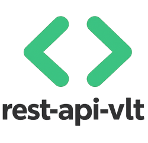

<p align="center">
  
</p>

<h1 align="center">rest-api-vlt — Static Infrastructure API</h1>

<p align="center">
  Static, read-only REST API exposing structured release and lifecycle metadata for infrastructure platforms<br/>
  <sub>GitHub Pages · JSON · Discovery-driven · No auth required</sub>
</p>

<p align="center">
  
  
  
  
  
</p>

---

## Overview

**rest-api-vlt** is a fully static, read-only REST API project that exposes structured release and lifecycle metadata for infrastructure platforms — Proxmox, Kubernetes, VMware vSphere, and major Linux distributions.

No backend, no authentication, no rate-limits. All data is stored as versioned JSON files and served directly from GitHub Pages.

```
Consumer ──► https://vlt-vl.github.io/rest-api-vlt
               │
               └── v1/index.json          → discovery entry point
                     │
                     ├── linux/           → Ubuntu · Debian · RHEL · Rocky · Fedora
                     ├── proxmox/         → PVE · PBS · PDM (releases + ISO downloads)
                     ├── kubernetes/      → release timeline with EoS dates
                     └── vmware/          → ESXi · vCenter (per major version branch)

Data sources (updated manually or via GitHub Actions)
               ├── Proxmox APT repo (Debian 13/trixie)  → proxmox/*/releases.json
               ├── Broadcom KB 316595                    → vmware/esxi/*/releases.json
               ├── Broadcom KB 326316                    → vmware/vcenter/*/releases.json
               ├── GitHub API kubernetes/kubernetes      → kubernetes/releases.json
               └── Distro trackers (Launchpad, etc.)    → linux/*/releases.json
```

---

## Available Endpoints

### Entry Point

```
GET /v1/index.json
```

Discovery document listing all vendors, products, and endpoint links.

### Linux

| Endpoint | Distribution |
|---|---|
| `/v1/linux/ubuntu/releases.json` | Ubuntu LTS + interim |
| `/v1/linux/debian/releases.json` | Debian stable / oldstable |
| `/v1/linux/rhel/releases.json` | Red Hat Enterprise Linux |
| `/v1/linux/rocky/releases.json` | Rocky Linux |
| `/v1/linux/fedora/releases.json` | Fedora |

### Proxmox

| Endpoint | Description |
|---|---|
| `/v1/proxmox/pve/releases.json` | Proxmox Virtual Environment releases |
| `/v1/proxmox/pbs/releases.json` | Proxmox Backup Server releases |
| `/v1/proxmox/pdm/releases.json` | Proxmox Datacenter Manager releases |
| `/v1/proxmox/downloads/pve.json` | PVE ISO downloads with SHA256 |
| `/v1/proxmox/downloads/pbs.json` | PBS ISO downloads with SHA256 |
| `/v1/proxmox/downloads/pdm.json` | PDM ISO downloads with SHA256 |

### Kubernetes

| Endpoint | Description |
|---|---|
| `/v1/kubernetes/releases.json` | All Kubernetes releases with EoS dates |

### VMware vSphere

| Endpoint | Description |
|---|---|
| `/v1/vmware/esxi/{version}/releases.json` | ESXi build numbers and patch history |
| `/v1/vmware/vcenter/{version}/releases.json` | vCenter build numbers and update history |

Available `{version}` values: `6.0` · `6.5` · `6.7` · `7.0` · `8.0` · `9.0` · `legacy`

---

## Architecture

```
rest-api-vlt/
├── readme.md
├── rest-api-vlt.png
├── .gitignore
│
└── v1/
    ├── index.json                          # discovery entry point + OpenAPI-like metadata
    │
    ├── kubernetes/
    │   └── releases.json
    │
    ├── linux/
    │   ├── ubuntu/releases.json
    │   ├── debian/releases.json
    │   ├── rhel/releases.json
    │   ├── rocky/releases.json
    │   └── fedora/releases.json
    │
    ├── proxmox/
    │   ├── pve/releases.json
    │   ├── pbs/releases.json
    │   ├── pdm/releases.json
    │   └── downloads/
    │       ├── pve.json
    │       ├── pbs.json
    │       └── pdm.json
    │
    └── vmware/
        ├── esxi/
        │   ├── {6.0,6.5,6.7,7.0,8.0,9.0,legacy}/releases.json
        └── vcenter/
            └── {6.0,6.5,6.7,7.0,8.0,9.0,legacy}/releases.json
```

---

## Data Sources

| Vendor / Product | Endpoint | Source | Automation |
|---|---|---|---|
| Kubernetes | `kubernetes/releases.json` | GitHub API `kubernetes/kubernetes` | ✅ Auto — GitHub API |
| Ubuntu | `linux/ubuntu/releases.json` | Launchpad API `api.launchpad.net/1.0/ubuntu/series` | ✅ Auto — REST API |
| Rocky Linux | `linux/rocky/releases.json` | GitHub API `rocky-linux/rocky` | ✅ Auto — GitHub API |
| Debian | `linux/debian/releases.json` | `debian.org/releases` | ✅ Auto — HTML scraping |
| RHEL | `linux/rhel/releases.json` | Red Hat article `access.redhat.com/articles/3078` | ✅ Auto — HTML scraping |
| Fedora | `linux/fedora/releases.json` | `fedoraproject.org/wiki/Releases` | ✅ Auto — HTML scraping |
| VMware ESXi | `vmware/esxi/*/releases.json` | Broadcom KB [316595](https://knowledge.broadcom.com/external/article/316595) | ✅ Auto — HTML scraping |
| VMware vCenter | `vmware/vcenter/*/releases.json` | Broadcom KB [326316](https://knowledge.broadcom.com/external/article/326316) | ✅ Auto — HTML scraping |
| Proxmox PVE releases | `proxmox/pve/releases.json` | `git.proxmox.com` — pve-manager bump commits | ✅ Auto — Git scraping |
| Proxmox PBS releases | `proxmox/pbs/releases.json` | `git.proxmox.com` — proxmox-backup bump commits | ✅ Auto — Git scraping |
| Proxmox PDM releases | `proxmox/pdm/releases.json` | `git.proxmox.com` — proxmox-datacenter-manager bump commits | ✅ Auto — Git scraping |
| Proxmox ISO downloads | `proxmox/downloads/*.json` | `enterprise.proxmox.com/iso/` directory + `SHA256SUMS` | ✅ Auto — HTTP scraping |

---

## GitHub Actions Automation

All endpoints are automated. Sources are split into three tiers by access method.

```
GitHub Actions (schedule: weekly Monday 06:00 UTC + workflow_dispatch)
    │
    ├── Tier 1 — Public REST APIs (stable, structured)
    │   ├── fetch-kubernetes.js     → api.github.com/repos/kubernetes/kubernetes/releases
    │   ├── fetch-ubuntu.js         → api.launchpad.net/1.0/ubuntu/series
    │   └── fetch-rocky.js          → api.github.com/repos/rocky-linux/rocky/releases
    │
    ├── Tier 2 — Public HTML / text scraping (page-structure dependent)
    │   ├── fetch-debian.js         → debian.org/releases
    │   ├── fetch-rhel.js           → access.redhat.com/articles/3078
    │   ├── fetch-fedora.js         → fedoraproject.org/wiki/Releases
    │   ├── fetch-vmware-esxi.js    → Broadcom KB 316595 (public, no auth)
    │   └── fetch-vmware-vcenter.js → Broadcom KB 326316 (public, no auth)
    │
    └── Tier 3 — Proxmox public endpoints (no subscription required)
        ├── fetch-proxmox-pve.js    → git.proxmox.com pve-manager "bump version" commits
        ├── fetch-proxmox-pbs.js    → git.proxmox.com proxmox-backup "bump version" commits
        ├── fetch-proxmox-pdm.js    → git.proxmox.com proxmox-datacenter-manager "bump version" commits
        └── fetch-proxmox-iso.js    → enterprise.proxmox.com/iso/ dir listing + SHA256SUMS
```

### Workflow properties

| Property | Value |
|---|---|
| Trigger | `schedule` weekly Monday 06:00 UTC + `workflow_dispatch` |
| Runtime | Node.js 24 |
| Branch | commits directly to `api` |
| Commit | `chore: auto-update releases YYYY-MM-DD` (only if diff detected) |
| Token | `GITHUB_TOKEN` (auto-provided — used for Kubernetes + Rocky GitHub API calls) |

### Scripts layout

```
.github/
└── workflows/
    └── update-releases.yml

scripts/
├── fetch-kubernetes.js       # GitHub API → v1/kubernetes/releases.json
├── fetch-ubuntu.js           # Launchpad API → v1/linux/ubuntu/releases.json
├── fetch-rocky.js            # GitHub API → v1/linux/rocky/releases.json
├── fetch-debian.js           # debian.org scraping → v1/linux/debian/releases.json
├── fetch-rhel.js             # RedHat KB scraping → v1/linux/rhel/releases.json
├── fetch-fedora.js           # Fedora wiki scraping → v1/linux/fedora/releases.json
├── fetch-vmware-esxi.js      # Broadcom KB 316595 → v1/vmware/esxi/*/releases.json
├── fetch-vmware-vcenter.js   # Broadcom KB 326316 → v1/vmware/vcenter/*/releases.json
├── fetch-proxmox-pve.js      # git.proxmox.com → v1/proxmox/pve/releases.json
├── fetch-proxmox-pbs.js      # git.proxmox.com → v1/proxmox/pbs/releases.json
├── fetch-proxmox-pdm.js      # git.proxmox.com → v1/proxmox/pdm/releases.json
└── fetch-proxmox-iso.js      # enterprise.proxmox.com/iso → v1/proxmox/downloads/*.json
```

---

## Base URL

```
https://vlt-vl.github.io/rest-api-vlt
```

Raw (alternative):

```
https://raw.githubusercontent.com/vlT-vl/rest-api-vlt/api
```

---

## Usage Example

```bash
# Discovery
curl https://vlt-vl.github.io/rest-api-vlt/v1/index.json

# Kubernetes releases
curl https://vlt-vl.github.io/rest-api-vlt/v1/kubernetes/releases.json

# Proxmox VE releases
curl https://vlt-vl.github.io/rest-api-vlt/v1/proxmox/pve/releases.json

# ESXi 8.0 build history
curl https://vlt-vl.github.io/rest-api-vlt/v1/vmware/esxi/8.0/releases.json
```

---

## Version & Build

| Field | Value |
|---|---|
| Version | 1.0.0 |
| Build | R260626 |
| Updated | 26 June 2026 |
| API version | v1 |
| Branch | `api` |

---

## License

rest-api-vlt is distributed under **Proprietary Source-Available License** — Copyright © 2026 Veronesi Lorenzo (vlT).

The source code is made publicly viewable for reference purposes, but the following are expressly prohibited without prior written consent of the owner:

- **Modification** — adaptation, translation or creation of derivative works
- **Redistribution** — copying, forking, republishing, sublicensing or repackaging
- **Commercial use** — selling, embedding in commercial products or services

All intellectual property rights remain exclusively with Veronesi Lorenzo (vlT). For licensing enquiries: [veronesilorenzo@outlook.com](mailto:veronesilorenzo@outlook.com)

---

**Copyright © 2026 vlT di Veronesi Lorenzo. All rights reserved.**
